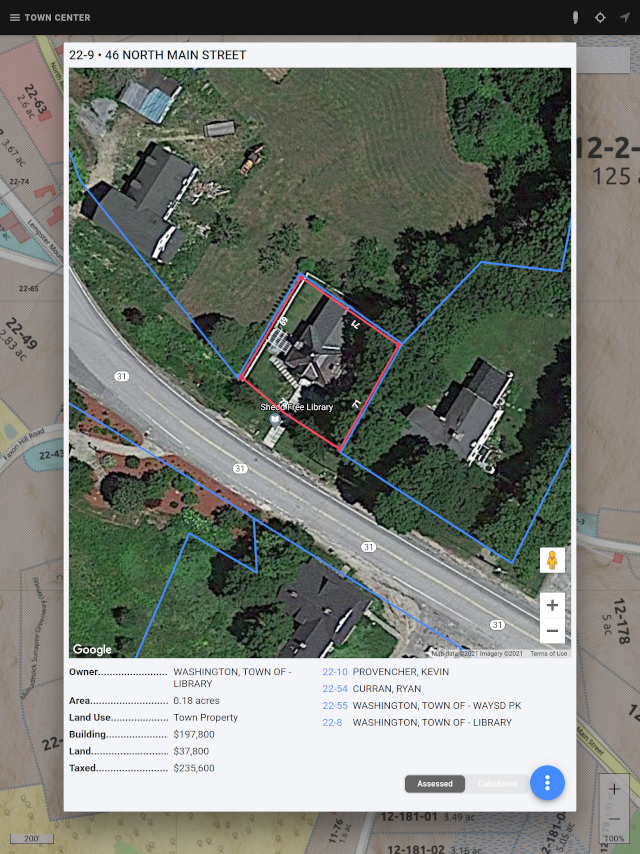
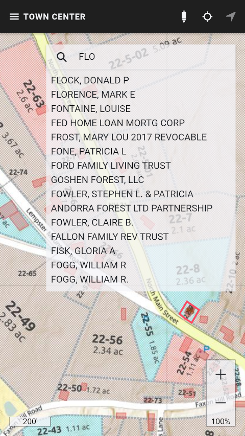
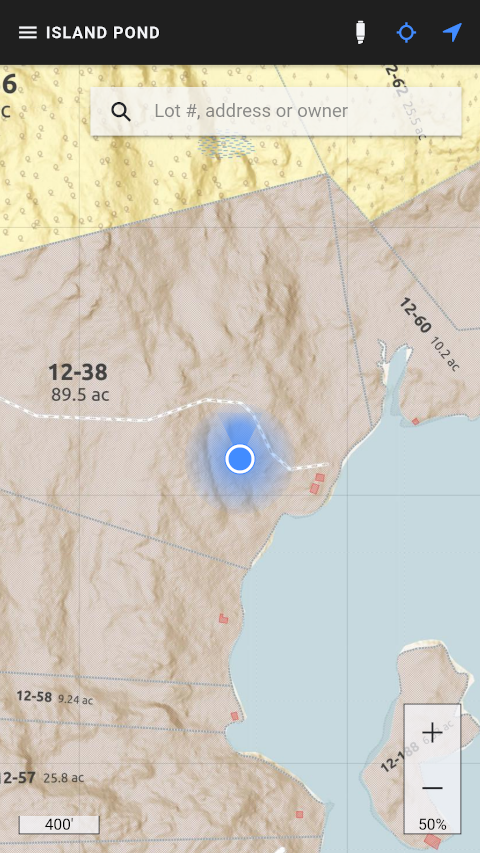
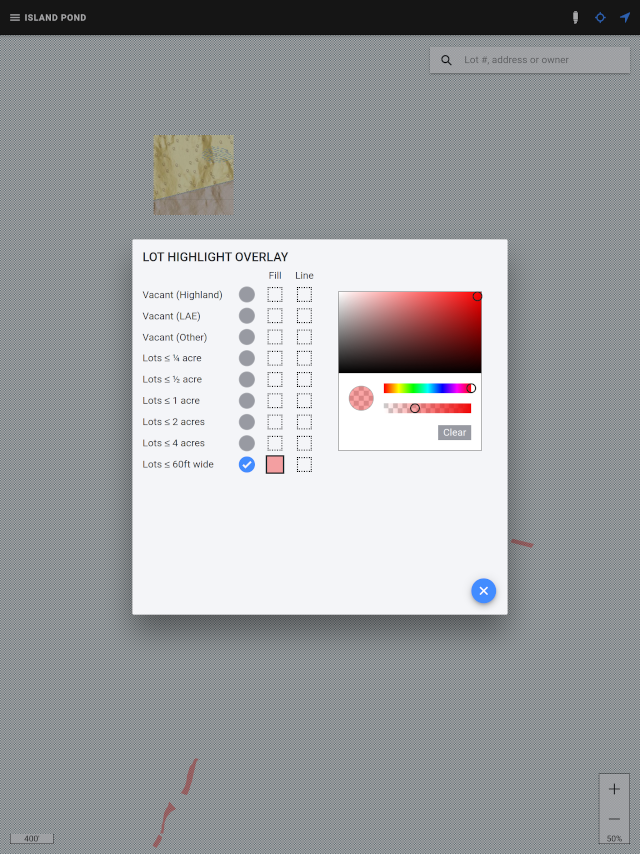
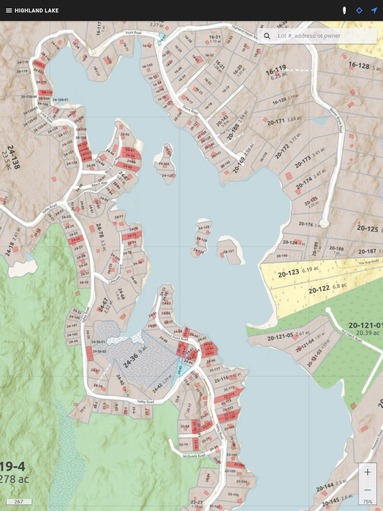

# Washington NH Interactive Parcel Map

A progressive web app (PWA) that interacts with the source images for the printed maps produced by the sister map-maker project [Washington NH Parcel Map](https://github.com/mflorence99/washington-mapmaker).

- [Washington NH Interactive Parcel Map](#washington-nh-interactive-parcel-map)
  - [On a laptop](#on-a-laptop)
  - [On an iPhone or iPad](#on-an-iphone-or-ipad)
  - [On an Android](#on-an-android)
  - [Getting Started](#getting-started)
  - [Exploring lot details](#exploring-lot-details)
    - [From the assessors' database](#from-the-assessors-database)
    - [Calculated by the app](#calculated-by-the-app)
  - [Find a lot](#find-a-lot)
  - [GPS tracking](#gps-tracking)
  - [Lot overlay highlighting](#lot-overlay-highlighting)

## On a laptop

Simply launch the app from [mflorence99.github.io](https://mflorence99.github.io).

> If we get any serious usage, we may have to move tha app to a for-fee host. It is very suited to AWS Lambda, for example.

## On an iPhone or iPad

1. Go to the site in Safari by entering mflorence99.github.io in the location bar.
2. The app should load quickly after the splash screen through your WiFi.
3. Tap the **Bookmark** icon at the bottom of the screen (it resembles a box with an upward-pointing arrow).
4. Tap **Add to Home Screen**. You have to swipe the bottom row of icons (copy, print, add bookmark etc) a little way to find that button.
5. You'll likely want to shorten the name then tap **Add**.
6. From now on, you just click the icon created just like any other app.

This page [explains the process](https://www.lifewire.com/home-screen-icons-in-safari-for-iphone-and-amp-ipod-touch-4103654) in a bit more detail.

## On an Android

TBD

## Getting Started

Select a map by clicking the hamburger menu at the top left of the page.

Zoom in and out with the controls at the lower right. Pan by pressing and dragging.

> The app always remembers your last position and zoom from session to session.

## Exploring lot details

Tap on a lot to explore its full details. Two categories of details are presented.

### From the assessors' database

### Calculated by the app

## Find a lot

You can search for a lot by its official reference number (as shown on the map, like 9-7) or by address or owner. Just enter a partial name or address and a dropdown of matches will appear.

## GPS tracking

The app can follow your position via GPS tracking. This is useful when trying to physically find a lot whose boundaries are not obvious.

> Many locations in Washington have poor GPS reception, owing to the tree canopy.

Tap the "target" icon at the top right to enable GPS tracking. Tap the "pointer" icon to have the app continually pan the map to show your current position.

## Lot overlay highlighting

The lot highlight feature is a powerful tool for local planners. It overlays the base maps with personalized highlighting to provide an overall picture of lots of interest: for example, nonconforming lots in a particular location.

> Any settings you make are personal, but persist from session to session. They are only lost when you "clear browsing history and data."

Tap the "highlighter" icon at the top right to get started.

Here we are looking for lots with insufficient sideline clearance by highlighting them in red.

Now we can get an overview of nonconforming lots in Highland Lake.

